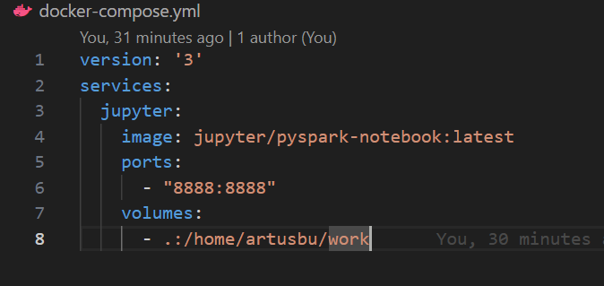
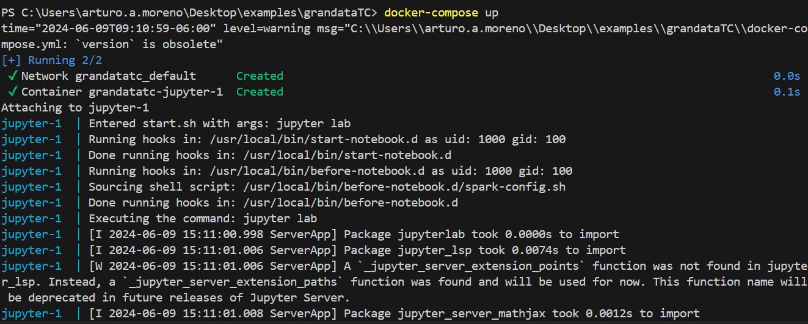
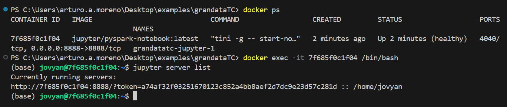
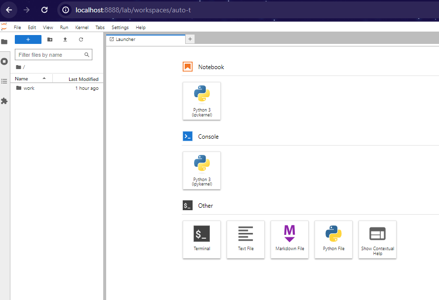
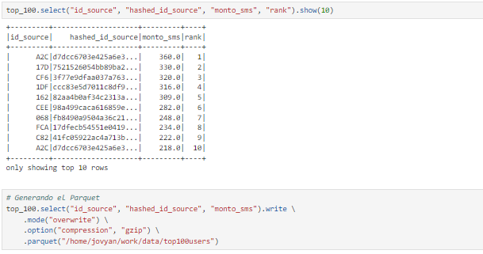
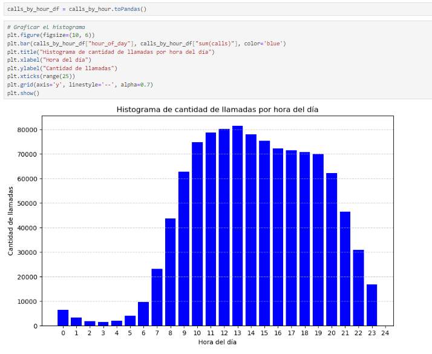

# grandataTC

#### Hello World! Gracias por dar un vistazo por aquí. Vamos con el desglose de este repositorio:

### Docker
En la primera parte, seteamos nuestro ambiente de Jupyter con la versión más reciente de Pyspark con la siguiente composición del docker-compose.

Se corre nuestra imagen con **docker-compose up**

Es necesario saber el token para ingresar a la UI de Jupyter:

Nos conectamos a nuestro workspace en el puerto 8888, **http://localhost:8888/**

### Estructura del proyecto.

Dentro de este repositorio se encuentra una carpeta llamda **proyectos**, dentro de esta carpeta hay una carpeta **data** con los datos para este proyecto, divididos en:
- raw: datos en crudo tal cual se descargaron.
- preprocessed: datos omitiendo los registros con nulls en alguna de las columnas de **"id_source"** y **"id_destination"** y cambiando los tipos de datos por unos más manejables para el análisis.
- processed: datos listos para tomar, formar reglas y analizar.

En la carpeta **project** se encuentran los notebooks del procesamiento y análisis de los datos. No se borraron los outputs para su visibilidad:
- cleaning.ipynb: procedimiento para análisis exploratorio inicial, drop de nulos.
- data_processing.ipynb: se agrega la columna **cuota_sms_region** para saber la tarifa de los sms según la región y se escriben estos insumos procesados casteando sus datos por tipos más manejables.
- analysis.ipynb: se resuelven los ejercicios, antes agregando una columna que multiplique la tarifa de los sms por el # de sms que se enviaron.
- carpeta **business** contiene módulos con la lógica del proyecto.

### Respuestas ejercicios.
- 1. $ 391367.0
- 2. 
  
  
- 3. 
  
  

**Nota: cada uno de los análisis viene mayor documentado en los notebooks**

## Ejercicio 2 - Preguntas generales.
1. La empresa cuenta con un cluster on premise de Hadoop en el cual se ejecuta, tanto el data pipeline principal de los datos, como los análisis exploratorios de los equipos de Data Science y Data Engineering. Teniendo en cuenta que cada proceso compite por un número específico de recursos del cluster:
- ¿Cómo priorizaría los procesos productivos sobre los de análisis exploratorios?
  - Particionando datos.
  - Prefetching.
  - Configurando queues desde YARN y asignando más recursos al queue productivo.
  - Configurar los análisis exploratorios en horarios no de alta demanda del día con algún scheduler de jobs como airflow.
- Debido a que los procesos productivos del pipeline poseen un uso intensivo tanto de CPU como de memoria, ¿qué estrategia utilizaría para administrar su ejecución durante el día? ¿Qué herramientas de scheduling conoce para tal fin?
  - Ejecución de procesos en diferentes partes del día y dependiendo de la lógica del negocio.
  - Ajuste dinámico de recursos (como una integración de airflow con AWS autoscaling y EMR)

 2. Existe una tabla del Data Lake con alta transaccionalidad, que es actualizada diariamente con un gran volumen de datos. Consultas que cruzan información con esta tabla ven afectada su performance en tiempos de respuesta.
  - Según su criterio, ¿cuáles serían las posibles causas de este problema?
      - Asiganción de recursos insuficientes.
      - Overload en los stages de los jobs.
      - Consultas ineficientes.
      - Problemas de red.
  - Dada la respuesta anterior, ¿qué sugeriría para solucionarlo?
      - Análisis y reconfiguración de recursos asignados para los jobs.
      - Análisis de los jobs y sugerir buenas prácticas para el libramiento de memoria.
      - Buenas prácticas como el join broadcast en vez de joins convencionales para cruces de datos.
      - Análisis de los logs de los jobs, sobre todo en los breakdowns y en los jobs más tardados.
      - Test en distintos ambientes.
      - Revisión de las configuraciones de red.
 3. Imagine un clúster Hadoop de 3 nodos, con 50 GB de memoria y 12 cores por nodo. Necesita ejecutar un proceso de Spark que utilizará la mitad de los recursos del clúster, dejando la otra mitad disponible para otros jobs que se lanzarán posteriormente.
  - ¿Qué configuraciones en la sesión de Spark implementaría para garantizar que la mitad del clúster esté disponible para los jobs restantes?
      - Dado que son 3 nodos con 12 cores por nodo. La mitad de nuestros recursos para el proceso de spark serán 18. (3 nodos * 12 clusteres / 2)
      - la memoria asignada debrá ser 25 Gb.
        -conf = SparkConf()\
            .set("spark.executor.instances", 18)\
            .set("spark.executor.memory", "25g")\   # Memoria por ejecutor
    
